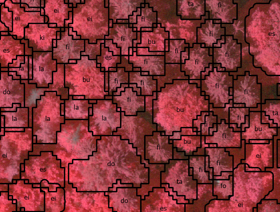

# Tree species segmentation and classification algorithm for SwissimageRS 2018 (Swisstopo)
Created by Raffael Bienz

The example orthophoto (test_area.tif) was kindly provided by Federal Office of Topography swisstopo (©swisstopo).

The other example data was kindly provided by the Kanton of Aargau.

## Algorithms
Two different neural networks are used: One for the segmentation of the tree crowns and one for the classification of the segmented crowns by tree species.

### Tree crown segmentation
- Model: resnet50_v1b pretrained on the coco dataset. 
- To train the model, crowns were manually segmented for 320 plots.

### Tree crown classification
- Model: mobilenet1.0 pretrained on ImageNet.
- To train the model, data from 3850 trees were collected in the field.
- The following groups of tree species are distinguished:
    - Ahorne (Acer spp.)
    - Buche (Fagus sylvatica)
    - Douglasie (Pseudotsuga menziesii)
    - Eichen (Querqus robur + petraea)
    - Gemeine Esche (Fraxinus excelsior)
    - Fichte (Picea abies)
    - Waldföhre (Pinus sylvestris)
    - Kirschen (Prunus avium + padus)
    - Lärche (Larix decidua)
    - Linden (Tilia cordata + platyphyllos)
    - Tanne (Abies alba)
    - Übriges Laubholz
    - Übriges Nadelholz

## Usage

### Clone repository and download data
```
git clone https://github.com/RaffiBienz/arborizer.git
```
Download example data and put it in the data folder: https://drive.google.com/file/d/1VJGAITIG_-k09earWOdKSjAnBkIJNyoO/view?usp=sharing

Download parameters for the neural networks and put the two folders in the src folder: https://drive.google.com/file/d/1sSN48YJ6Prjyg_sxfGq5fi22aMJGzagQ/view?usp=sharing


### Setup Python
- Install Python 3.6.7 (https://www.python.org/ftp/python/3.6.7/python-3.6.7-amd64.exe). On Windows higher versions cause problems. On Linux higher versions work.
- Open config_template.R and save as config.R.
- Add the path to the python or an anaconda environment in config.R. If python is defined as a environment variable just type "pyhton" in config.R.
- Install packages mxnet (1.5.0) and gluoncv (0.4.0) -> see requirements.txt
- If a suitable GPU is available and the CUDA-environemnt is installed, instance segmentation should automatically use the GPU. Otherwise the CPU is used, which is much slower. If problems occur, set ctx=[mx.cpu(0)] in predict_masks_folder.py (line 13) manually.

**Example setup with Anaconda**

Open Anaconda Powershell Prompt and type:
```
conda create -y -n arborizer python==3.6.7
conda activate arborizer
pip install -r .\requirements.txt
```
Open config_template.R, save as config.R and add the path to the conda environment in config.R. Typically: C:/Users/USERNAME/.conda/envs/arborizer/python.exe

### Setup R
- Install R and if desired RStudio.
- Required packages: rgdal, rgeos, raster, imager, doParallel, foreach, sf (see install_packages.R)
- These packages are installed automatically when you run main.R.

### Docker
Alternatively to the above setup you can also use the Dockerfile provided.

### Required data
- Swissiamge RS (10x10 cm / RGBI or IRGB / Federal Office of Topography swisstopo) with trees in leaf.
- Vegetation height model (1x1m / raster) where areas >= 21 m = 1 and areas < 21 m = 0 (model works only for tall trees, areas < 21 m are excluded from calculations).
- Forest delineation (shapefile)
- Fishnet of the area (30x30 m / shapefile). This can be generated with main.R based on the forest delineation (set new_fishnet = True in config.R)

### Execute script
- If desired, adjust further settings in config.R (at least python_path, see Setup Python).
- Open main.R and set the working directory to the arborizer folder.
- Run main.R (in a shell or via RStudio).
- Check the result folder for the output.

## Performance
Segmentation achieved a mean average precision of 30.9 on the validation dataset. Evergreen trees are not detected as well as deciduous trees. This may be due to the relatively small crowns of evergreen trees. Regaring deciduous trees, the algorithm has the tendency to conjoin the crowns of multiple trees.

Classification achieved an accuracy of 86 % on the validation dataset. However, the algorithm works better for evergreen trees than for deciduous trees.




## Change Log
### Update January 2023
The model was improved as follows:
- New tree crown segmentation model trained with more data.
- New tree crown classification model trained with more data.
- Improved overlap cleanup.
- Faster export of tree images.
- Due to poor classification accuracy Quercus rubra was integrated into the class "Other deciduous trees".